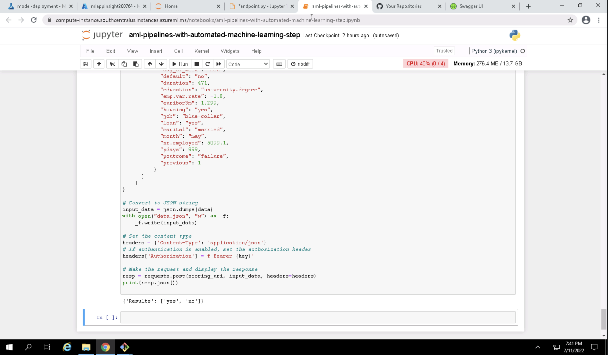

# Operationalizing Machine Learning Final Project
This is the final project for the Operationalizing Machine Learning Module as part of the Machine Learning Engineer for Azure Nanodegree by Udacity.

## Overview
This project serves to demonstrate Azure Machine Learning Studio's ability to train a machine learning model with AutoML, publish a pipeline, and deploy the model such that it can be accessed via an API request to make a prediction. This project includes the following steps:

### 1. Authentication
Create a Service Principal using `az`. I used the provided environment, so this step will be skipped as my account did not have the proper permissions to set this up. If I were to use my personal Azure account, this would allow me to ensure that specific resources had the correct permissions to access other resources.

### 2. Automated ML Experiment
Using the [Bankmarketing dataset](https://automlsamplenotebookdata.blob.core.windows.net/automl-sample-notebook-data/bankmarketing_train.csv), a binary classification model will be trained through AutoML with the goal of identifying if a client will subscribe to a term deposit with the bank. This includes uploading the data as a "Registered Dataset", as shown in the screenshot below:

Once the dataset has been uploaded, we can create a new experiment through Azure ML Studio by going to `Automated ML`, selecting `New Automated ML job`, selecting the uploaded `bankmarketing_train` Dataset, and selecting a compute cluster to run the job on. The completed experiment for my run can be found below:

From this completed experiment, we're then able to get the best model, in this case it was a VotingEnsemble model with an AUC_Weighted score of 0.94735:

### 3. Deploy the Best Model
Given this best model, we are then able to deploy it using an Azure Container Instance (ACI), which allows us to interact with the model by sending POST requests to the generated endpoint. To send a request to the endpoint for a prediction, all that is required is the endpoint URI, the primary key, and the JSON data that will be sent in the body of the request.

### 4. Enable Logging
In order to monitor the performance of the deployed model and see incoming requests and outgoing responses as well as output logs, Application Insights should be enabled. While this can be done by checking the box to enable App Insights at the time of deployment, it can also be done through the Python SDK for Azure. Once App Insights is enabled, this can be seen on the Details tab of th endpoint, as shown in the image below:

Once we ensure App Insights is enabled, we can then view the logs for the model. This can be done directly through App Insights, but they can also be printed in the Python console, as seen below:

The script to do this is located at `starter_files/logs.py`

### 5. Swagger Documentation
Swagger is a powerful tool that helps to better visualize API requests and responses. It gives users information about the expected request body as well as expected responses. The information to populate a Swagger UI is provided to us on the deployed endpoint as a JSON file that can be viewed on a local containerized instance of Swagger. In the image below, we can see that once we download the `swagger.json` from the endpoint deployment Details page and serve it through the Python script located at `starter_files/swagger/serve.py`, the details of the endpoint are populated including available routes:

We can also see the expected format of the POST request body:

Lastly, we are able to see the expected responses from the previous request. The example shows `example_value` as the response, but in this case, it will be a list of either `yes` or `no` depending on the model's prediction:

In addition to viewing the API details, Swagger UI also allows you to make requests directly through the UI if you authenticate with a valid Authorization Bearer token at the top of the page. On this locally hosted instance of Swagger UI, this cannot be done due to issues with CORS, but normally you would be able to make a request directly by passing your request JSON into the UI and clicking "Execute".

### 6. Consume Model Endpoints
With the model deployed and our endpoint available, we can run the `starter_files/endpoint.py` in order to get a prediction for two examples. We can see the output of this in the two images below, where the first image is from Jupyter Notebook from a compute instance in Azure while the second is from a bash terminal run locally:

We can see that the output is the same for both requests, demonstrating a couple of the ways we can consume the model through the deployment endpoint.

### 6.5 Benchmark
Now that the model is deployed and accessible, it is important to ensure that the model is consistently performing at the level we are expecting. This includes more than just in terms of precision and accuracy, but also in terms of how quickly requests are handled. By using [Apache Benchmark](https://httpd.apache.org/docs/2.4/programs/ab.html), we are able to get an estimate for how many requests the deployed model can handle in a certain amount of time. The screenshot below is the output from running Apache Benchmark, and we can see that it took 5.822 seconds to successfully complete 10 requests for an average of 1.72 requests per second and an average of 582.161 ms per request:

Apache Benchmark is a great tool to ensure that a deployed model is able to handle the expected request volume before being deployed into a production environment and even for ensuring that the model is performant after being released.

### 7. Create, Publish, and Consume a Pipeline
While all of these steps listed above can be completed manually through the Azure Machine Learning Studio, they can also be done programmatically using the Azure SDK for Python. These steps are outlined in the `starter_files/aml-pipelines-with-automated-machine-learning-step.ipynb`. Since the experiment, dataset, and compute cluster were already created previously, we can update the notebook to reference these rather than recreating them. Once that has been done, the `AutoMLConfig` and the `PipelineData` objects for metrics and model data can be created and used to create the `AutoMLStep` that will be used in the AzureML `Pipeline`. Once this pipeline has been submitted ot the existing experiment, we can see it in Azure ML Studio under `Pipelines`, as seen below:

Once the job is complete and the best model has been identified, the pipeline can be published. This creates the REST endpoint that can be used to interact with the newly trained model. The new Pipeline Endpoint can be seen in Azure ML Studio under the `Pipeline endpoints` tab in the `Pipelines` section in the portal:

Looking at the published pipeline in the image below, we can see the full pipeline consists of only two main components: The Bankmarketing dataset and the AutoML module. On the right side of the page under the `Published pipeline overview`, we can also see the endpoint and that the status is `Active`.

Next, we can submit a pipeline run to the published pipeline endpoint by sending a POST request to the endpoint with the `ExperimentName` in the in the JSON request body. The status of the run can be monitored with the `RunDetails` widget, as seen below:

Looking at the pipeline jobs in Azure ML Studio, we see the newly created job as part of the `pipeline-rest-endpoint` job:

Viewing the details of this job, we can see the the `Run ID` matches what we previously saw in the `RunDetails` widget from in the notebook:

And with that, we have a pipeline to train and deploy a new model and an endpoint that we can use to interact with it. Whether it's through Azure ML Studio directly or the Azure SDK for Python, Azure Automated ML can be leveraged to train and deploy highly performant models quickly and efficiently.

## Architecture Diagram
The overall flow of can be summarized in the diagram below:

## Future Enhancements
For future enhancements for this project, I would have liked to make the Swagger UI work properly, allowing requests to be made directly from the UI rather than just seeing the example request and response bodies. Additionally, I would like to set up a pipeline with a different type of model with a different goal than classification, such as a Named Entity Recognition (NER) model to extract entities from text. While the pipeline would likely have many similarities, I imagine there are some aspects that would be different. Any other type of model would also be interesting to look at so that I can compare how the set-up may differ from one model to another.

## Screencast
A screencast of the project can be found here: https://streamable.com/loapzn
